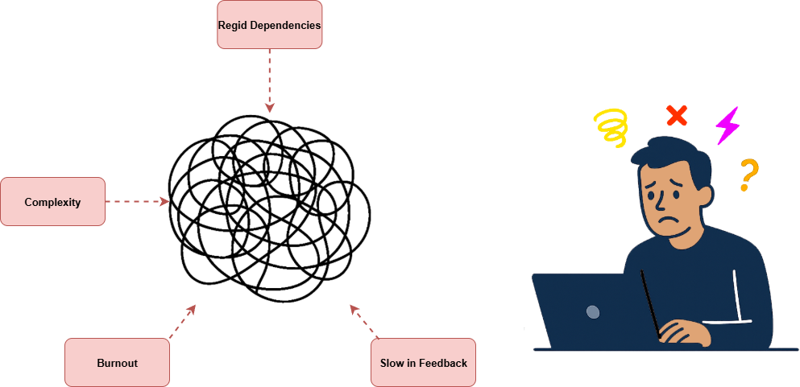

# Vibe Coding with C# 13 in Enterprise Environments (csharp13-vibe-coding-enterprise)

## Overview
Learn how clean code, clean architecture, and modern C# 13 features transform enterprise systems with Ziggy Rafiq's article "Vibe Coding with C# 13 in Enterprise Environments
Enterprise software development often struggles with complexity, rigid architectures, and developer burnout.  
This repo demonstrates how to apply **Vibe Coding** — the flow-based approach that combines:

- **C# 13 modern features** (primary constructors, collection literals, interceptors, etc.)  
- **Clean Architecture** for maintainability and scalability  
- **DDD patterns** (Entities, Value Objects, Repositories, Aggregates)  
- **Best practices & industry standards** (SOLID, CQRS, automated testing)  

**Link to the Article** **[Clean Code, Clean Architecture, and Sustainable Practices with Vibe Coding C# 13 in Enterprise Environments](https://www.c-sharpcorner.com/article/clean-code-clean-architecture-and-sustainable-practices-with-vibe-coding-c-sharp-13/)**  

### Enterprise Development Challenges


### The Benefits of Clean Architecture and Vibe Coding


###  Vibe Coding in Enterprise Environments with C# 13: Adopt a Clean Architecture as a foundation


### Create a Vibe Coding Charter


### Enterprise Customer and Order Processing API


### Best Practices & Industry Standards


### The Vibe Coding Flow


## Key Features

- **Domain Layer** → Immutable entities (`Order`, `Customer`), `OrderStatus` enum, repository interfaces.  
- **Application Layer** → Services (`CustomerService`, `OrderService`) orchestrating business logic.  
- **Infrastructure Layer** → JSON-based repositories (`InMemoryCustomerRepository`, `InMemoryOrderRepository`).  
- **API Layer** → Minimal API endpoints for `Customers` and `Orders`.  
- **Data** → Preloaded `customers.json` and `orders.json` files.  

---

## How to Run

```bash
# Clone repo
git clone https://github.com/ziggyrafiq/csharp13-vibe-coding-enterprise.git
cd csharp13-vibe-coding-enterprise

# Restore & build
dotnet restore
dotnet build

# Run API
cd src/VibeCoding.Api
dotnet run
```

API will be available at:  
- `http://localhost:5037`  
- `https://localhost:7243`


## API Endpoints

### Customers
```http
GET /api/customers/{id}?role=Admin
```

### Orders
```http
POST /api/orders/{id}/approve
```

---

##  Seed Data

Located in `VibeCoding.Data/`

- **customers.json** → Predefined customer records with roles (`Admin`, `User`, `Auditor`).  
- **orders.json** → Predefined orders with `Pending`, `Approved`, `Rejected` status.  

## Tech Stack

- **C# 13 / .NET 10**
- **ASP.NET Core Minimal API**
- **Domain-Driven Design (DDD)**
- **Clean Architecture**
- **System.Text.Json** for serialization

## Article Details  

- **Title:** Clean Code, Clean Architecture, and Sustainable Practices with Vibe Coding C# 13 in Enterprise Environments
- **Author:** Ziggy Rafiq  
- **Link:** [Read the full article](https://www.c-sharpcorner.com/article/clean-code-clean-architecture-and-sustainable-practices-with-vibe-coding-c-sharp-13/)  

 ## License
This code is released under the MIT License. See the LICENSE file for more information.

## Stay Connected
For updates and more articles, follow me:

* LinkedIn: [Ziggy Rafiq LinkedIn](https://www.linkedin.com/in/ziggyrafiq/)
* GitHub: [Ziggy Rafiq GitHub](https://github.com/ziggyrafiq)
* Website [Ziggy Rafiq Website](https://ziggyrafiq.com)

## About The Author Ziggy Rafiq

Ziggy Rafiq works as a Technical Lead Developer and is a prominent public figure in the tech industry and developer community. With over 20 years of experience as a Full-Stack Designer, Developer, Tester, DevSecOps, Technical Architect,
Software Project Manager, and expert in Agile Management Best Practices and Standards, Ziggy is widely respected for his knowledge and skills. He is also an author, regularly contributing articles
to [C# Corner](https://www.c-sharpcorner.com/members/ziggy-rafiq), and [Geek Coding](https://geekcodinghub.com/members/ziggy-rafiq) to
share his expertise and wisdom with a global audience. Ziggy also has a YouTube Channel where he creates content based on his experience to help and inspire other developers, designers, testers, project managers,
technical architects, and Agile Scrum masters.

- **Technical Lead Developer, Mentor and Trainer**
- **[C# Corner (MVP 🏅, VIP⭐️, Public Speaker🎤)](https://www.c-sharpcorner.com/members/ziggy-rafiq)**
- **[Geek Coding Writter](https://geekcodinghub.com/members/ziggy-rafiq)**
- **[Technology Manager Writter](https://technology-manager.com/members/ziggy-rafiq)**
- Link to [**Ziggy Rafiq Blog**](https://blog.ziggyrafiq.com)
- Link to [**Ziggy Rafiq Website**](https://ziggyrafiq.com)

* [**Please remember to subscribe to My YouTube channel**](https://www.youtube.com/)
* [**Please remember to follow me on LinkedIn**](https://www.linkedin.com/in/ziggyrafiq/)
* [**Please remember to follow me on Twitter/X**](https://twitter.com/ziggyrafiq)
* [**Please remember to follow me on Instagram**](https://www.instagram.com/ziggyrafiq/)
* [**Please remember to follow me on Facebook**](https://www.facebook.com/ziggyrafiq)
  
Happy Coding!
